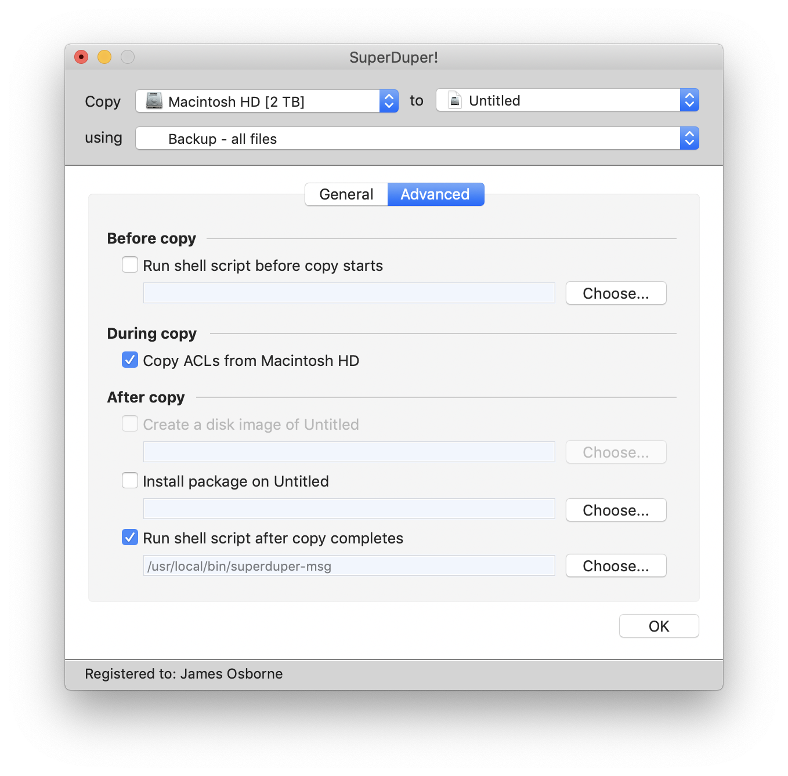

## notification-utils

### About

This repository contains utility scripts for generating mobile notifications from a number of applications. The only supported messaging service (at the moment) is the awesome, and free, [pushover.net](https://pushover.net). You will need an account at [pushover.net](https://pushover.net). The following scripts exist:

* pushover - a wrapper to send messages to the pushover service itself
* superduper-msg - a script designed to be called by [SuperDuper!](https://www.shirt-pocket.com/SuperDuper/SuperDuperDescription.html) once a copy is complete

Other notification scripts and tools will be added to this repository as they are generated. The following sections describe how to set-up and use these scripts.

### Installation

All scripts can be installed (to ```/usr/local/bin```) thus:
```
sudo make install
```
Uninstallation is achieved thus:
```
sudo make uninstall
```

### pushover

#### Introduction

The script, imaginatively called **pushover**, can either be sourced in a script, or called directly from the command-line. Either way, it requires two environment variables—`PO_USER_TOKEN` and `PO_APP_TOKEN`—be set with values from your [pushover.net](https://pushover.net) account (see usage). The script exits if these environment variables are not set.

Responses from curl and [pushover.net](https://pushover.net) are sent to stdout.

#### Dependencies

The following are requirements to use **pushover**:

1. Requires an account at pushover.net;
2. Requires curl.

#### Usage

Install, configure and use **pushover** in the following way:

0. [Sign up](https://pushover.net/login) for an account at pushover;
1. Take note of your User Key;
1. Create an Application/API Token;
1. Install pushover app on your mobile device;
1. Then grab a copy of this repository:
```
git clone https://githib.com/jjo93sa/notification-utils
```
6. Ensure pushover script is executable
```
chmod u+x notification-utils/scripts/pushover
```
7. Send a test message, using the Key and Token values retrieved earlier:
```
cd notification-utils/scripts
PO_USER_TOKEN=<string> PO_APP_TOKEN=<string> ./pushover "Hello, world!"
```
8. You might consider exporting the environment variables, for example execiting these commands in your shell, and placing them in .bash_profile:
```
export PO_USER_TOKEN=<string from pushover.net>
export PO_APP_TOKEN=<string from pushover.net>
```
9. And it might make sense to put the **pushover** script into a directory on your path, for example:
```
sudo cp notification-utils/scripts/pushover /usr/local/bin
```

### superduper-msg

#### Introduction

The excellent SuperDuper! disk cloning tool has the facility to run scripts before and after a copy operation. Here, we use the "after copy" script to send a pushover notification informing the user that the copy has been completed. However, we can't determine if the copy was successful, so one must always check for error messages from the application.

#### Dependencies

Requires pushover, and assumes that pushover is installed in ```/usr/local/bin```

#### Usage

Add the full path to ```superduper-msg``` in the SuperDuper copy configuration:



### Support and features

Ping me if you have any questions or requests.

### License

Distributed under the MIT License, see LICENSE file in the repository root for more information.
